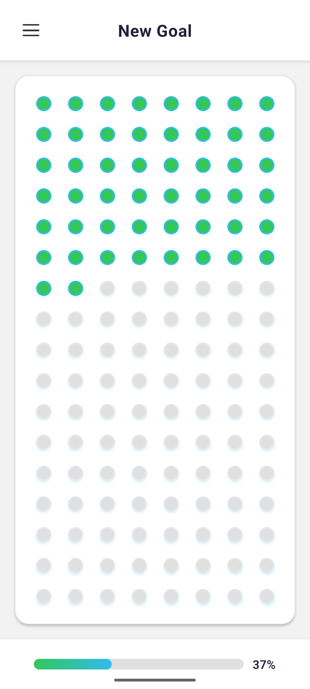
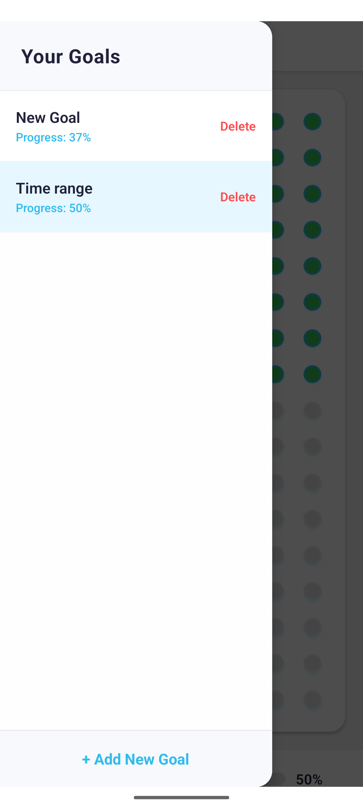
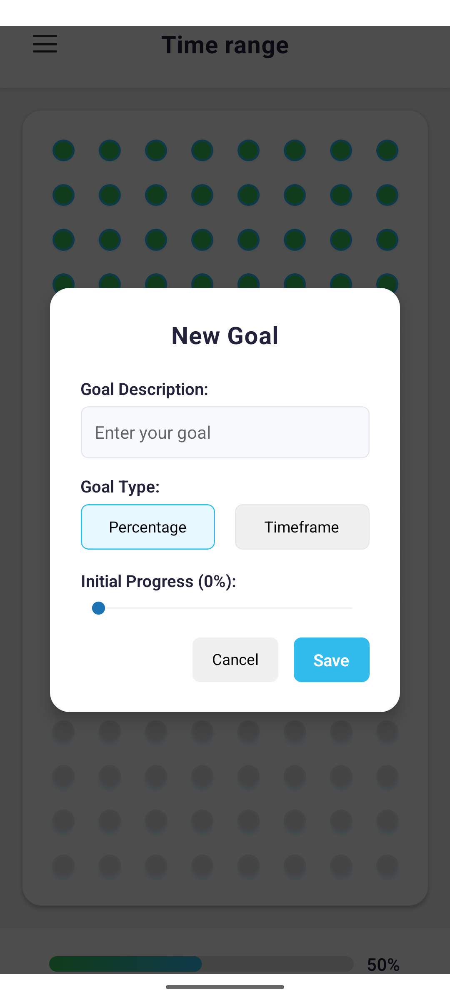
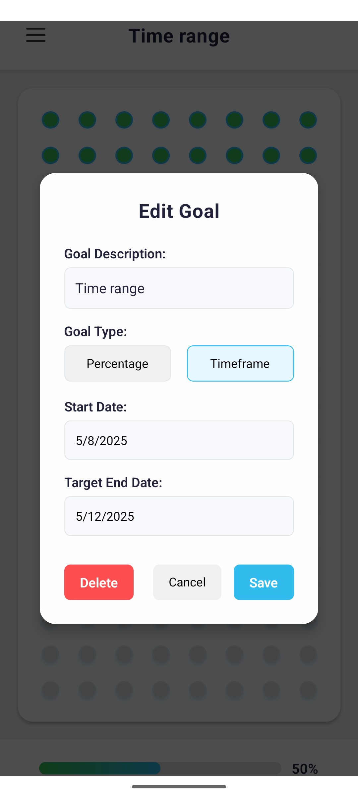

# Vibe Code Android App 🚀

> A weekend project built with Claude AI, just for fun! 

## About

This Android app was created during a weekend coding session with Claude AI. It's a testament to how quickly you can build something cool when you combine human creativity with AI assistance.

## Screenshots

<p align="center">
  
  
  
  
</p>

## Tech Stack

- React Native
- Expo
- TypeScript
- Claude AI for development assistance

## Getting Started

1. Install dependencies:
   ```bash
   npm install
   ```

2. Start the development server:
   ```bash
   npx expo start
   ```
